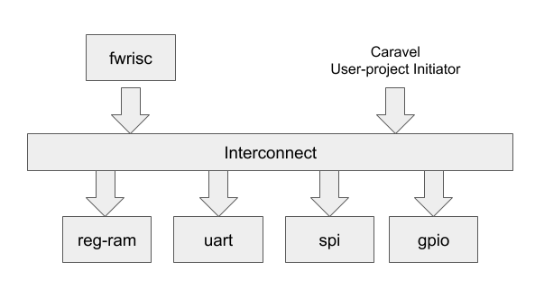
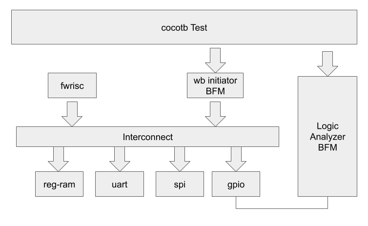

# FWPayload

FWPayload is a small processor+peripherals subsystem, targeting the user-project
area of Caraval.

## Block diagram


## Current Status
FWPayload is taking Option #1 for integration into Caravel. Specifically,
FWPayload is integrated into a customized version of user_proj_example
(stored in verilog/rtl/fwpayload/user_proj_example.v). The config in
openlane/user_proj_example creates a macro from this description, and
that macro is integrated into user_project_wrapper using the provided
configuration.

Openlane completes on user_proj_example with no DRC errors, and the 
following antenna violations:

```
Number of pins violated: 52
Number of nets violated: 51
Total number of nets: 34963
```

Running with diode-insertion strategy 3 (default) results in the 
following:
```
Number of pins violated: 193
Number of nets violated: 146
Total number of nets: 34963
[INFO]: Generating Final Summary Report...
[SUCCESS]: Flow Completed Without Fatal Errors.
```

Integration tests pass for both RTL and gate-level simulations.

### On-boarding FWPayload
Caravel files (.gds,.lef,etc) have been copied from caravel/mpw-one-a tag
on 20201206.
A merged .gds is created by running the 'ship' target. The result is:

```
221398 problems occurred.  See feedback entries.
Using technology "sky130A", version 1.0.72-0-gb427e3b
```

### Pre-Check Status
- Step 1 -- Pass
- Step 2 -- Pass
- Step 3 -- Fail
    - Documentation  -- Pass
    - Makefile       -- Pass
    - Pins           -- Fail
        - Looks like the script finds arrayed ports in the .v and broken-out in the .lef
- Step 4 -- Fail
```
{{PROGRESS}} Executing Step 4 of 4: Checking DRC Violations.
{{PROGRESS}} Running DRC Checks...
{{FAIL}} DRC Checks on GDS-II Failed, Reason: Total # of DRC violations is 21405435
TEST FAILED AT STEP 4
```


## External IP
FWPayload uses several pieces of external IP. Some are bundled with the project,
and some are fetched during the project-initialization step.

### FWRISC
RISC-V core originally targeted for FPGA application
- Git: https://github.com/mballance/fwrisc.git
- License: Apache 2.0

### fw-wishbone-interconnect
Parameterized Wishbone interconnect
- Git: https://github.com/featherweight-ip/fw-wishbone-interconnect
- License: Apache 2.0

### simple_spi_master
SPI master IP, obtained from the Caravel repository. Bundled with the project.
- License: GNU LGPL

### simpleuart
UART IP, obtained from the Caravel repository. Bundled with the project.
- License: BSD-style


## Memory map

The FWPayload memory map is designed to fit within the 28-bit user-area
portion of the Caravel memory map. 

- *0xX000_0000..0xX000_03FF* - 1Kb register RAM
- *0xX100_0000..0xX100_00FF* - UART
- *0xX100_0100..0xX100_01FF* - SPI
- *0xX100_0200..0xX100_02FF* - GPIO

## Pin map

0  (i) - unused
1  (i) - unused
2  (i) - unused
3  (i) - unused
4  (i) - unused
5  (i) - unused
6  (i) - unused
7  (i) - unused
8  (i) - unused
9  (i) - unused
10 (i) - unused
11 (i) - unused
12 (o) - GPIO-out [0]
13 (o) - GPIO-out [1]
14 (o) - GPIO-out [2]
15 (o) - GPIO-out [3]
16 (o) - UART Tx
17 (i) - UART Rx
18 (i) - SPI SDI
19 (o) - SPI CSB
20 (o) - SPI SCK
21 (o) - SPI SDO
22 (o) - SPI SDOENB
23 (o) - GPIO-out [4]
24 (o) - GPIO-out [5]
25 (o) - GPIO-out [6]
26 (o) - GPIO-out [7]
27 (i) - GPIO-in  [0]
28 (i) - GPIO-in  [1]
29 (i) - GPIO-in  [2]
30 (i) - GPIO-in  [3]
31 (i) - GPIO-in  [4]
32 (i) - GPIO-in  [5]
33 (i) - GPIO-in  [6]
34 (i) - GPIO-in  [7]
35 (i) - unused
36 (i) - unused
37 (i) - unused


## Bring-up/Debug Support

FWPayload uses the Caravel logic analyzer to configure reset and clocking,
probe the program counter of the FWRISC, and optionally, single-step the clock.

- [127]    - Controls the clock when configured as an output
- [126]    - Controls the system reset (active low) when configured as an output
- [125]    - Controls the FWRISC core reset when configured as an output
- [124:41] - unused
- [43:40]  - Loopback, driving the GPIO input low bits
- [39:36]  - Loopback, probing the GPIO output low bits
- [35]     - unused
- [34]     - Loopback, driving UART rx input
- [33]     - Loopback, probing UART tx output
- [32]     - Input, probing the 'instruction-complete' FWRISC net
- [31:0]   - Input, probing the FWRISC program-counter net

# Developer Notes

## Required Tools
- Python 3       (3.6.8 was used)
- Icarus Verilog (11.0 was used)
- Verilator      (4.102 was used)
- Openlane       (rc5 from openlane/mpw-one-a tag was used)
- Skywater PDK   (PDK_ROOT is assumed to be properly set)

## Project Setup
The FWPayload project uses IVPM (IP and Verification Package Manager) to manage
external IP and Python dependencies. The project can be setup both with and
without IVPM installed.

In both cases, setting up the project will result in creation of a `packages`
directory within the project that contains external IPs and required Python
packages.

### Setup with IVPM installed
Ensure IVPM is installed:

```
% pip3 install ivpm --user --upgrade
```

```
% cd <fwpayload_dir>
% ivpm update
```

### Setup without IVPM installed
The project can also be setup without installing IVPM. The `bootstrap.sh` 
script is provided for this purpose. `bootstrap.sh` clones a local 
copy of ivpm.

```
% cd <fwpayload_dir>
% ./bootstrap.sh
```


## Integration Testing

Testing of the fwpayload subsystem is done using a cocotb test environment.
The block diagram is shown below:



Bus Functional Models (BFMs) are used to drive the Caravel management interface
and logic-analyzer pins. 

### Tests
- fwrisc_gpio
  - Loads a small program into the RISC-V core that writes to the GPIO outputs
  - Drives the clock via the logic-analzer interface while monitoring the GPIO outputs
  
- mgmt_mem_access
  - Tests 1, 2, and 4-byte accesses to register RAM via the management interface

### Running an individual test
Individual tests are run from the dv/<test> directory by running 'make'. 

```
% cd dv/fwrisc_gpio
% make clean
% make
```

### Test Controls

Test behavior is controlled using environment variables. 
- SIM - Selects the simulator to run
    - icarus -- Icarus Verilog (default)
    - vlsim -- Verilator, via the vlsim front-end
- DEBUG[=1] - Controls whether wave files should be saved
    


